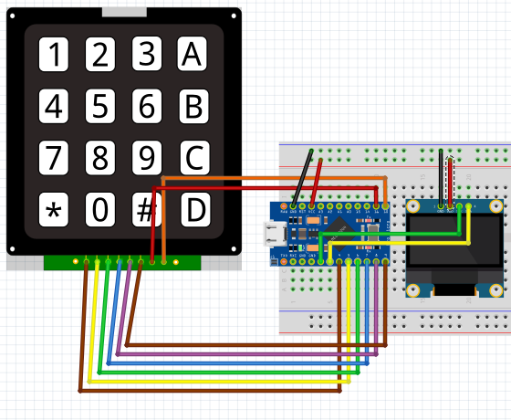

# 4x4 Keypad and OLED Display Demo
This demo is Arduino code for Pro Micro boards. The screen will display they keys entered on the keypad. They will clear when you press the `*` button.

# Hardware
* <a target="_blank" href="https://amzn.to/3sZASLX">I2C OLED Display Module 0.91" I2C SSD1306 - 128x32 _~$10 for two_</a>
* <a target="_blank" href="https://amzn.to/3mwmJno">Multi-Pack - Pro Micro Board - ATmega32U4 _~$20 for four_</a>
* <a target="_blank" href="https://amzn.to/2Q2ZnJU">Single Board(If you don't want the multi-pack) - Pro Micro Board - ATmega32U4 _~$8 for one_</a>
* <a target="_blank" href="https://amzn.to/2Q2ZnJU">5 Pack 4x4 Matrix Array Keypad (These usually come in multi-packs.) _~$7 for five_</a>

I used a 128x32 OLED Display, but this also works on 128x64 OLED Displays as well. You'll just have to update the configuration in `keypad_screen_demo.ino`.

* <a target="_blank" href="https://amzn.to/3g45J6P">0.96 inch OLED Module SSD1306 _~$10 for two_</a>

# Wiring Diagram

# Installation
Connect your `Pro Micro Board` to your computer and open `keypad_screen_demo.ino` with the Arduino IDE. 

In `Tools > Board` select `Arduino Leonardo`.

Select the correct port that your `Pro Micro Board` is plugged into via `Tools > Port`. This board should come installed with the `Arduino IDE`.

Hit the `Verify` button. Install any necessary libraries via `Tools > Manage Libraries`. Below is the list of libraries I used in this project. You should be able to find them pretty quick by typing these into the search bar. All libraries are found in the Arduino Library Manger(`Tools > Manage Libraries`.) No special installation is needed outside of their library.

Libraries Used:
* Adafruit_SSD1306 (For the OLED Display)
* Keypad (Mark Stanley, Alexander Brevig)

Once everything is verified successfully, hit the `Upload` button. If your OLED is wired up correctly, when you press a button, it's character will show on the screen.

# Usage
Plug Micro-USB into the Arduino and everything should boot up successfully in less than 10 seconds.

# Support You
Whatever you need; questions answered, requests, bugs; make an Issue. I'll get to them as soon as I can.

# Support Me
Support me with some Bitcoin! - Wallet: 1NjSoJX4biGi5hW72NX7eLYvzMVgjChfRA

Or buy me a coffee - Venmo - @AndrewBudziszek

(FYI - there are affliliate links here to hardware you might need.)
